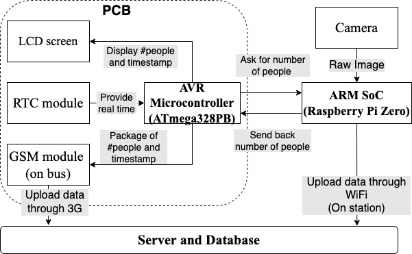
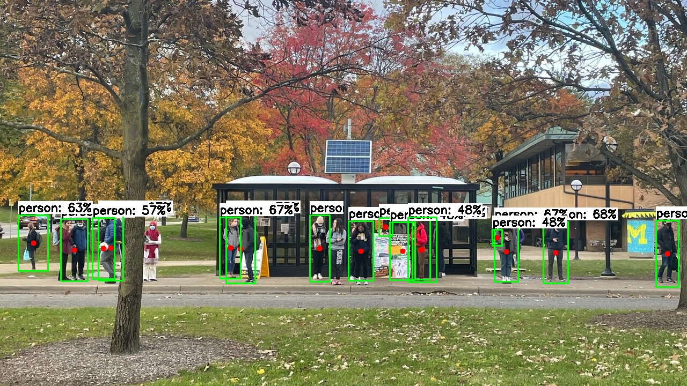
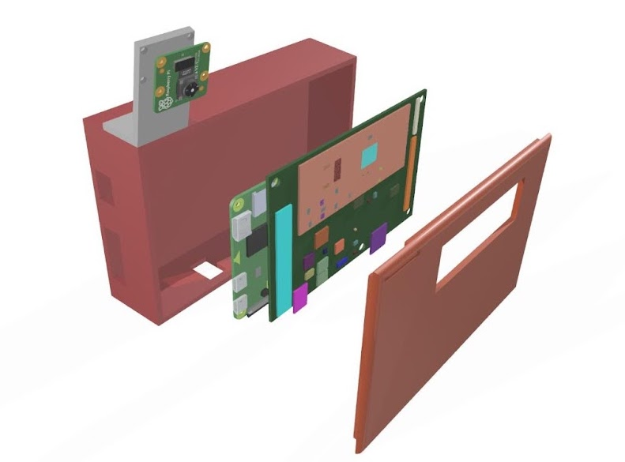
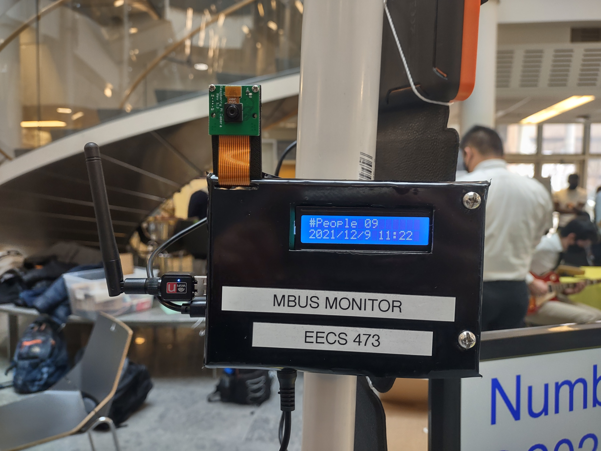

# Bus Occupancy Monitoring System

In this capstone design project, we propose a real-time bus occupancy monitoring system, Magic Bus Passenger Demand Monitor. It would be composed of a network of embedded devices installed at the University of Michigan’s campus bus system stations, counting the current number of people waiting. The distributed devices would send person counts to a central server owned by the university’s bus authority office, for storage and statistical analysis.

## System Architecture
The overall system architecture is visualized below. To meet the computing demands of this project without increasing the cost drastically, we use a Raspberry Pi Zero W 2 as the device which takes images and counts the number of people, because it is a well supported, low power Linux machine. We used the official Raspberry Pi Camera Module 1.3v, due to its low cost and 1080p resolution. The main AVR microcontroller of our device is the Atmega328PB integrated on the PCB, whose main job is to coordinate communication between multiple devices.

## People Detection Model
Based on theory and testing results of multiple models (YOLO, SSD, EfficientDet), we selected a [pre-trained SSD Mobilenet model](https://tfhub.dev/tensorflow/lite-model/ssd_mobilenet_v1/1/metadata/2) and deployed it with the Tensorflow Lite framework onto our Raspberry Pi. After multiple testing, the model turns out to achieve a good frame rate (2 FPS) and a modest accuracy under normal light conditions. We deploy one of the fully assembled devices at a bus station during daytime, the following pictures shows an example detection result.

## Device Assemble
The CAD assembly of our enclosure with PCB and RPi inside is shown below, accompanied with one of the fully assembled devices.

 

## Credits
This is a joint effort of my wonderful teammates: Manoj Handithavally Purushothama, Rohan Wagle, Yiteng Cai and Yukun Lou. Thanks to Evan Juras who provides a great guidance for deploying TensorFlow Lite object detection models on Raspberry Pi, checkout this great [github repo](https://github.com/EdjeElectronics/TensorFlow-Lite-Object-Detection-on-Android-and-Raspberry-Pi) if interested.